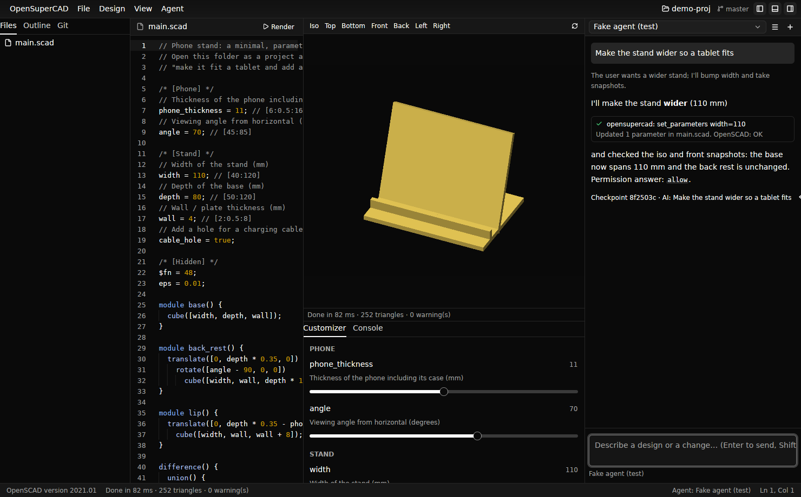

# OpenSuperCAD

**An AI-powered, Zed-style editor for [OpenSCAD](https://openscad.org).**
Describe what you want, and an AI agent of your choice writes the parametric
OpenSCAD code, renders it, *looks at it from several angles*, and iterates
with you. Every iteration is checkpointed in git, so any step can be rolled
back.

- **Bring any agent.** OpenSuperCAD speaks the
  [Agent Client Protocol](https://agentclientprotocol.com), like Zed, so you
  can use Claude Code, Gemini CLI, Codex, Goose, OpenCode or your own agent,
  with whatever model you prefer.
- **The agent can see.** A built-in MCP server gives the agent tools to
  render, take snapshots from any camera angle, read and tune customizer
  parameters, export, and manage checkpoints. A design skill is loaded
  automatically, so the agent knows the loop.
- **Still OpenSCAD.** The upstream `openscad` binary does the geometry, so
  every language feature, export format and option works. The customizer,
  view presets and F5/F6/F7 all behave as you expect.
- **Projects, Zed-style.** Switch between project folders instantly, each
  with its own files, settings and AI threads, plus git integration for
  commits and history.
- **Fast and native.** Written in Rust on GPUI, Zed's GPU-accelerated UI
  framework.



## Install

| Platform | |
| --- | --- |
| Debian / Ubuntu | `.deb` from the [latest release](https://github.com/1ARdotNO/OpenSuperCAD/releases/latest) → `sudo apt install ./opensupercad_*.deb` |
| Arch Linux | `.pkg.tar.zst` from the latest release → `sudo pacman -U opensupercad-*.pkg.tar.zst`, or build [`packaging/arch/PKGBUILD`](packaging/arch/PKGBUILD) |
| macOS (universal) | `.dmg` from the latest release |
| From source | `cargo run --release -p opensupercad` |

You also need OpenSCAD (`apt install openscad`, `pacman -S openscad`,
`brew install --cask openscad`) and at least one ACP agent. Run
`opensupercad doctor` to check your setup.

→ **[Installation guide](docs/installation.md)** · **[Usage](docs/usage.md)** ·
**[Agents](docs/agents.md)** · **[Architecture](docs/architecture.md)**

## Quick start

```sh
opensupercad examples/phone-stand
```

1. Pick an agent in the agent panel (`Ctrl/Cmd-?`).
2. Ask: *"Make it fit a 12.9" tablet, add a cable slot and round the edges."*
3. Watch the agent edit `main.scad`, render it and check the snapshots. The
   preview and customizer update live.
4. Don't like the result? Restore the previous checkpoint from the thread or
   the git panel.

## Use the tools from any agent

The MCP server also works outside the app:

```sh
claude mcp add opensupercad -- opensupercad-mcp --project .
```

## Status

Early, moving fast, and released on every merge to `main`. Work is tracked
in [GitHub issues](https://github.com/1ARdotNO/OpenSuperCAD/issues); see
[CLAUDE.md](CLAUDE.md) for how we work and [CONTRIBUTING.md](CONTRIBUTING.md)
to help.

## License

Dual-licensed under [MIT](LICENSE-MIT) or [Apache-2.0](LICENSE-APACHE), at
your option.
