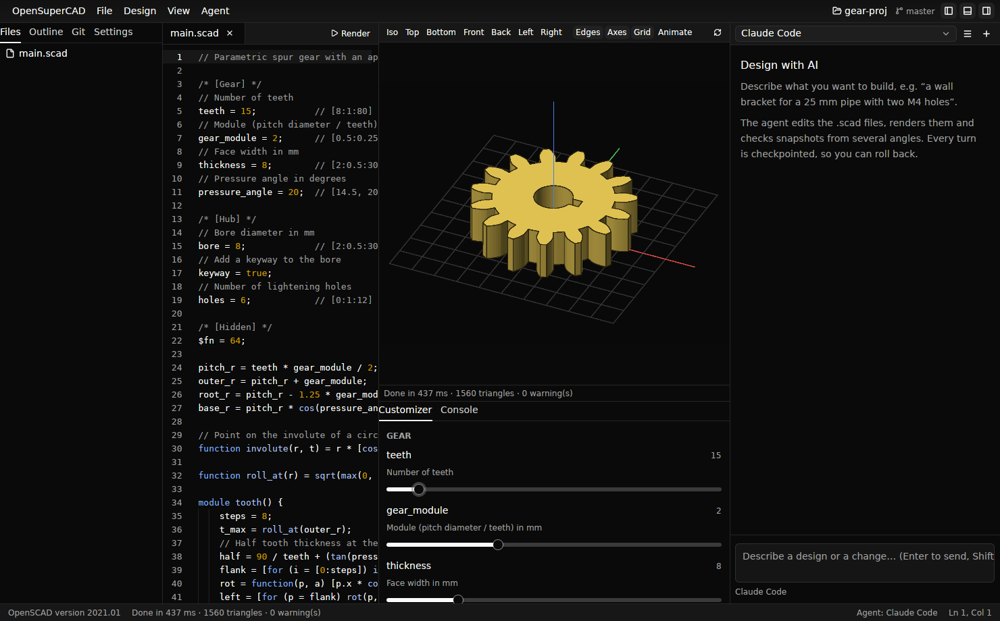
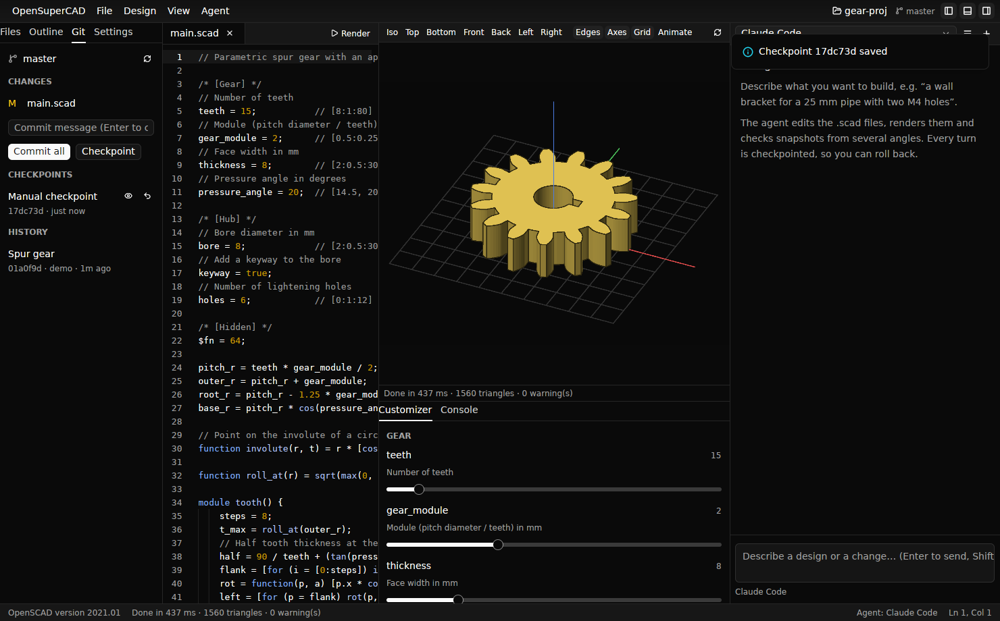
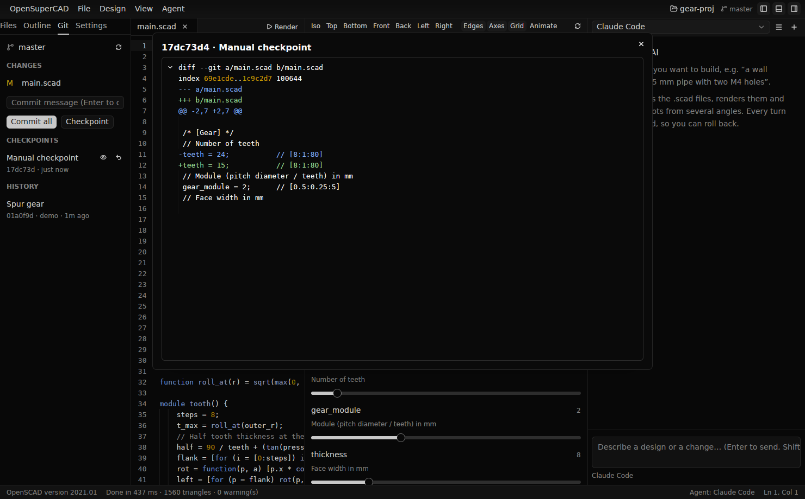
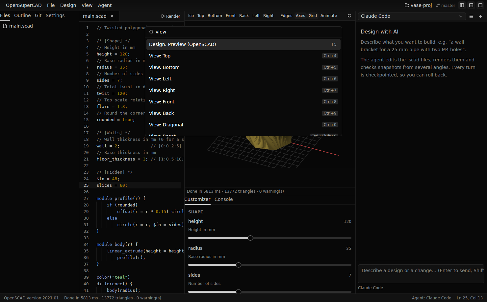

# Using OpenSuperCAD

## The window

The layout follows Zed: one window per project, with docks around a central
editor.



```
┌ Title bar: menus · project ▾ · branch ───────────── panel toggles ┐
│ Files │ Editor (main.scad)      │ Preview  [Iso][Top]…   │ Agent ▾ ☰ + │
│ Outline│                        │   (drag to orbit)      │  messages   │
│ Git   │                         ├────────────────────────┤  tool calls │
│       │                         │ Customizer │ Console   │  [prompt…]  │
└ Status bar: OpenSCAD version · last render · agent · cursor ──────────┘
```

- **Project panel** (left): file tree, outline of the open file, and git
  (changes, commit, checkpoints).
- **Editor** (center): tabs for every open file (a dot marks unsaved edits)
  and OpenSCAD source with tree-sitter highlighting and line numbers. While
  you edit a library that the main file pulls in with `use`/`include`, the
  preview and the customizer stay on the main file, so you see the change
  in context. OpenSCAD errors and warnings are underlined in the editor and
  listed in the console. Click a console entry to jump to its line.
- **Preview**: the rendered model. Drag to orbit, Shift-drag to pan, scroll
  to zoom. The buttons switch between OpenSCAD's view presets and toggle
  edge outlines, axes (X red, Y green, Z blue) and the build-plate grid.
  With OpenSCAD 2024 or newer the interactive view shows `color()` (the
  model is exported as 3MF); with older releases it is single-coloured.
  Press `F5` for OpenSCAD's own preview, including the `#`/`%` modifiers.
- **Customizer**: OpenSCAD's customizer, with the same groups, sliders,
  dropdowns, checkboxes and text fields, driven by the comments in your file.
  Changing a value edits the source in place and re-renders.

  
- **Agent panel** (right): AI threads for the current project.
- **Console** (tab next to the customizer): OpenSCAD's errors, warnings and
  `echo()` output. It opens automatically when a render fails.

## Projects

A project is a folder, ideally a git repository. Open one with
**File → Open Folder…** (`Ctrl/Cmd-O`), switch between recent projects
from the project switcher in the title bar or `Ctrl/Cmd-Alt-O`, or run
`opensupercad path/to/folder` from a terminal. On start-up the last project
is reopened.

Switching projects switches everything: the file tree, open file, preview,
customizer and the set of AI threads. Threads belong to a project and are
remembered per project, so you can come back to a conversation later.

The **main file** is what gets previewed and what the agent works on by
default: `main.scad` if present, otherwise the first `.scad` file. Change it
in the **Settings** tab.

### Project settings

Open the **Settings** tab in the project panel to choose the main file, the
default agent, whether to checkpoint after each AI turn, and the OpenSCAD
geometry backend (Manifold is much faster on OpenSCAD 2024+). The tab also
toggles the theme and opens `agents.json`.

Settings are stored in `<project>/.opensupercad/settings.json`, which you can
commit to share them:

```json
{
  "main_file": "parts/enclosure.scad",
  "default_agent": "claude-code",
  "auto_checkpoint": true,
  "openscad_backend": "manifold"
}
```

## The AI design loop

1. Open the agent panel (`Ctrl/Cmd-?`) and pick an agent (see [agents.md](agents.md)).
2. Describe what you want: *"A wall-mount bracket for a 25 mm pipe, two M4
   screw holes, printable without supports."*
3. The agent edits the `.scad` files, renders, and **looks at snapshots from
   several angles** through the built-in MCP tools before reporting back.
   You see each tool call and the snapshots it took, and the preview updates
   live as files change. Unsaved edits are saved before the agent's tools
   run, so the agent always works on what you see.
4. Iterate: *"make the walls 3 mm"*, *"add a fillet where the arm meets the
   plate"*. For simple tweaks the agent uses the customizer parameters
   directly.
5. Every turn ends with a **checkpoint**. If an iteration goes wrong, roll
   back from the checkpoint marker in the thread or from the git panel.

Agent permission prompts appear inline. Choose *Allow once*, *Always*, or
*Reject*. Press `Esc` in the agent panel or click **Stop** to cancel a turn.

## OpenSCAD features

Everything OpenSCAD does still works, because OpenSuperCAD runs OpenSCAD
itself.

| Action | Shortcut (Linux / macOS) | OpenSCAD equivalent |
| --- | --- | --- |
| Preview (OpenSCAD's own OpenCSG preview, from the current camera) | `F5` | Design → Preview |
| Render (full geometry, shown in the interactive viewport) | `F6` | Design → Render |
| Export STL | `F7` | File → Export → STL |
| Export… (3MF, OFF, AMF, OBJ, DXF, SVG, PDF, PNG, CSG; the extension picks the format) | `Ctrl/Cmd-Shift-E` | File → Export |
| Reload from disk | `Ctrl/Cmd-R` | Design → Reload and Preview |
| View: top / bottom / left / right / front / back / diagonal | `Ctrl/Cmd-4` … `9`, `0` | View menu |
| Reset view | `Ctrl/Cmd-Shift-0` | View → Reset View |
| Save | `Ctrl/Cmd-S` | File → Save (also triggers preview, as with OpenSCAD's auto-reload) |

Exports use the same file as the preview: while you edit a library that the
main file pulls in, `F7` exports the main design. The STL is written next to
it. Without a native file dialog (no xdg-desktop-portal on Linux),
OpenSuperCAD asks for the path in its own dialog.

**Animation.** Designs that use OpenSCAD's `$t` can be animated. Click
**Animate** in the preview toolbar: OpenSuperCAD renders 24 frames
(`$t = 0 … 23/24`) in the background, then **Play** loops them and the frame
strip lets you scrub to any moment. Saving re-renders the frames. Try
`examples/animation`.

Customizer annotations follow the OpenSCAD conventions:

```openscad
/* [Dimensions] */            // starts a group (tab)
// Outer width in mm          // description shown under the parameter
width = 60;      // [20:1:200]  slider: min:step:max
style = "round"; // [round:Rounded, sharp:Sharp]  dropdown with labels
wall = 2;        // [1, 2, 3]   dropdown
label = "Hi";    // 8           text field, max length 8
fillet = 0.4;    // 0.1         spin box step
lid = true;                     // checkbox
size = [10, 20, 30];            // vector editor
/* [Hidden] */                  // not shown
$fn = 64;
```

Only literal assignments before the first `module`/`function` are
parameters, as in OpenSCAD.

## Git and checkpoints

OpenSuperCAD manages git for you, Zed-style, through the git panel in the
project panel:

- **Changes**: modified and untracked files.
- **Commit**: write a message and press `Enter` (or **Commit all**) to
  commit everything.
- **Checkpoints**: one per AI turn, plus any you create yourself
  (`Ctrl/Cmd-Alt-S`).



Checkpoints are real git commits on a separate branch,
`osc/checkpoints/<your-branch>`. They are built through a temporary index,
so taking one **never touches your branch, your staged changes or your
working tree**. That means:

- **View changes** (the eye icon, or **Changes** in the thread) shows a
  highlighted diff of what that iteration changed.
  
- **Restore** brings all project files back to a checkpoint. The current
  state is checkpointed first, so a restore can itself be undone.
- **Commit** ("promote") turns the current state into a normal commit on your
  branch once you are happy with an iteration.
- The checkpoint branch can be inspected with any git tool:
  `git log osc/checkpoints/main`.
- Checkpoints stay local unless you push them. To clean up, delete the
  branch: `git branch -D osc/checkpoints/main`.

If a project is not a git repository yet, the first checkpoint runs
`git init` for you.

## Keyboard shortcuts

`Ctrl` on Linux, `Cmd` on macOS:

| Shortcut | Action |
| --- | --- |
| `Ctrl-Shift-P` | Command palette: every command, fuzzy-searchable (see below) |
| `Ctrl-P` | Find file in the project |
| `Ctrl-Alt-O` | Recent projects |
| `Ctrl-O` | Open folder (project) |
| `Ctrl-N` | New `.scad` file |
| `Ctrl-S` | Save |
| `Ctrl-W` | Close tab (saves it first) |
| `Ctrl-Tab` / `Ctrl-Shift-Tab` | Next / previous tab |
| `Ctrl-B` | Toggle project panel |
| `Ctrl-J` | Toggle customizer / console |
| `Ctrl-?` | Toggle agent panel |
| `Ctrl-Shift-N` | New agent thread |
| `Enter` / `Shift-Enter` | Send prompt / new line (agent panel) |
| `Esc` | Stop the agent (agent panel) |
| `Ctrl-Alt-S` | Take a checkpoint |
| `Ctrl-Shift-G` | Focus git panel |
| `F5` / `F6` / `F7` | Preview / Render / Export STL |
| `Ctrl-4` … `Ctrl-0` | View presets |
| `Ctrl-Q` | Quit |



## Reporting bugs and crashes

The **Help** menu (also in the command palette) has *Report a Bug…*,
*Request a Feature…* and *Open Issues Page*. A bug report opens GitHub's
bug form with your OpenSuperCAD version, OS and architecture filled in.

If OpenSuperCAD (or its MCP server) crashes, it writes a crash report to the
`crashes` folder in the data directory (see below). On the next start you're
asked whether to report it. **Report on GitHub** opens a new issue with the
report filled in, which you can review and edit before submitting. Nothing is
sent automatically. Reports contain the version, OS, the panic message and a
backtrace. They never include your files, and your home directory is shown
as `~`. *Help → Show Crash Reports* opens the folder.

## Command line

```text
opensupercad [PATH]                 open a project folder (or the folder of a .scad file)
opensupercad mcp [--project DIR]    run the MCP server on stdio (for external agents)
opensupercad doctor                 check OpenSCAD, git, snapshots and agents
opensupercad update [--check]       update from GitHub Releases (see installation.md#updating)
opensupercad --version
```

## Data locations

| What | Linux | macOS |
| --- | --- | --- |
| Recent projects and threads | `~/.local/share/opensupercad/` | `~/Library/Application Support/OpenSuperCAD/` |
| App settings (`app-settings.json`: update checks) | `~/.local/share/opensupercad/` | `~/Library/Application Support/OpenSuperCAD/` |
| Crash reports | `~/.local/share/opensupercad/crashes/` | `~/Library/Application Support/OpenSuperCAD/crashes/` |
| Agent overrides (`agents.json`) | `~/.config/opensupercad/` | `~/Library/Application Support/OpenSuperCAD/` |
| Project settings | `<project>/.opensupercad/settings.json` | same |

Override the data directory with `OPENSUPERCAD_DATA_DIR`.
